# FAST ISB Schedule Platform

A unified student scheduling platform for FAST ISB with three major tools in one website:

- Exam schedule viewer
- Weekly class timetable viewer
- Free room finder

The app supports both regular cohort flows and custom mixed-course flows for irregular students.

## What Is Included

### 1. Exams
- Filter by batch, school, and department.
- Search by course code or course name.
- Grouped timeline view by date.
- Exam detail drawer (mobile + desktop optimized).
- Export current results to `.ics`, `.xlsx`, and `.csv`.

### 2. Timetable
- Filter by batch, department, and section.
- List view and visual grid view.
- Detect overlapping class conflicts.
- Toggle repeat courses on/off.
- Export current timetable to `.ics`, `.xlsx`, and `.csv`.

### 3. Free Rooms
- Check empty rooms for a selected day + slot.
- See full-week availability map.
- Distinguishes:
   - Fully vacant rooms
   - Partially vacant rooms (at least 30 free minutes in a slot)

### 4. Custom Workflows
- Custom Exams: add mixed rows from different batches/departments and build a merged exam list.
- Custom Timetable: build class sets from mixed rows and save reusable named bundles.
- Local persistence using browser storage for saved preferences and custom bundles.

## Screenshots

### Home / Configuration
<p>
   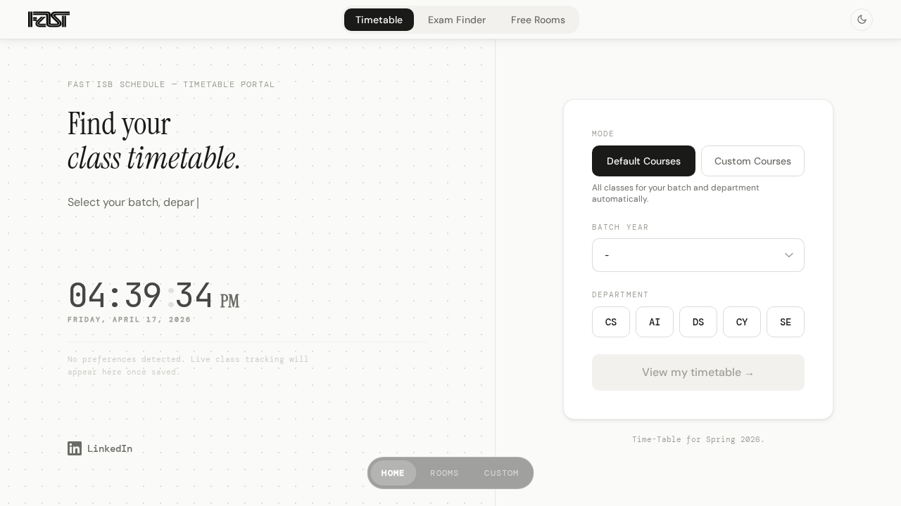
   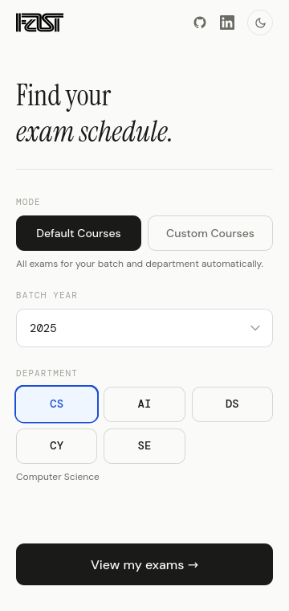
</p>

### Exam Schedule
<p>
   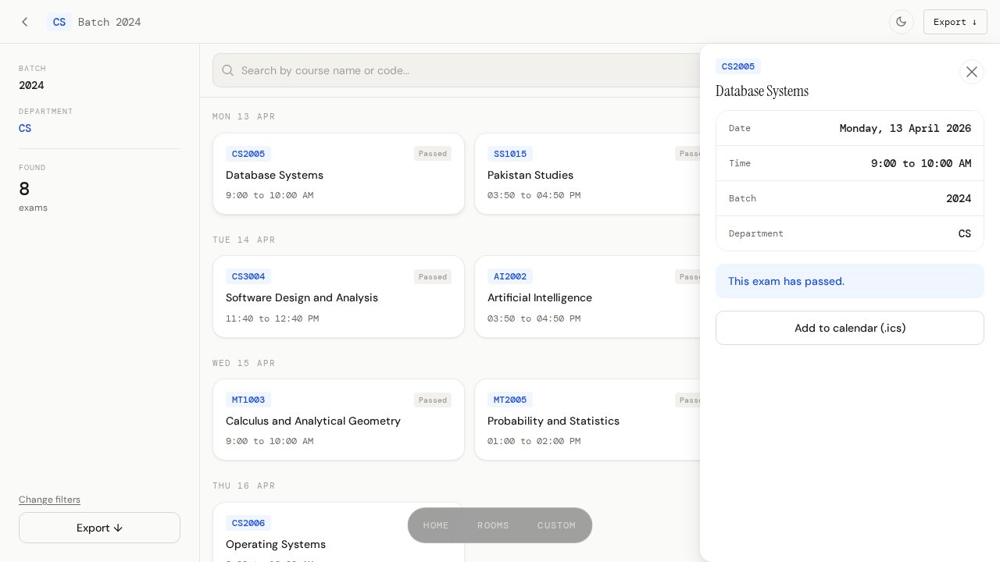
   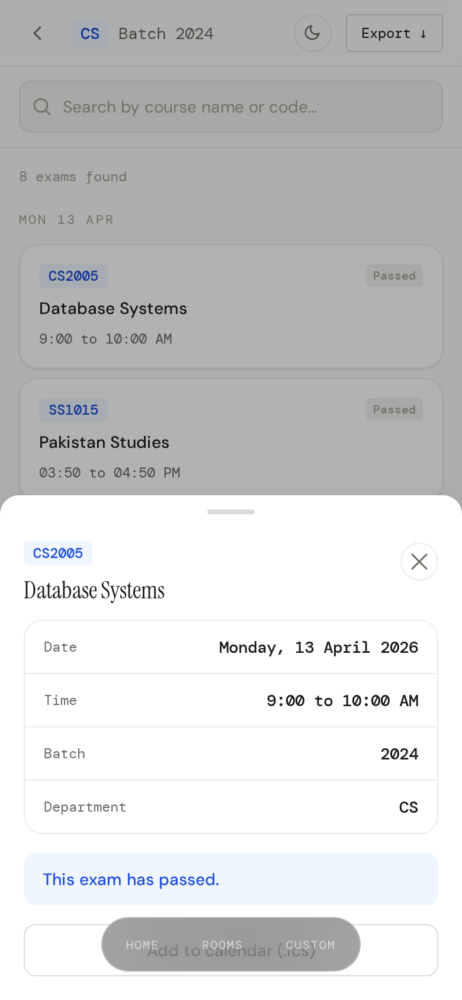
</p>

### Timetable
<p>
   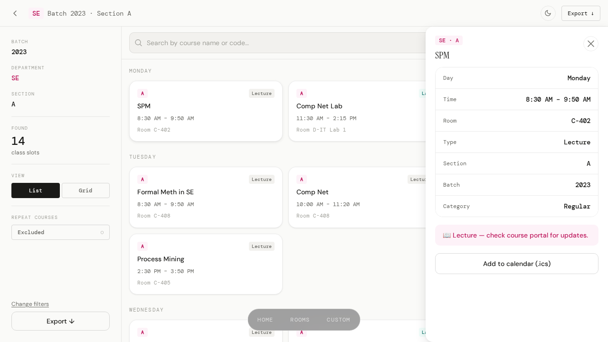
   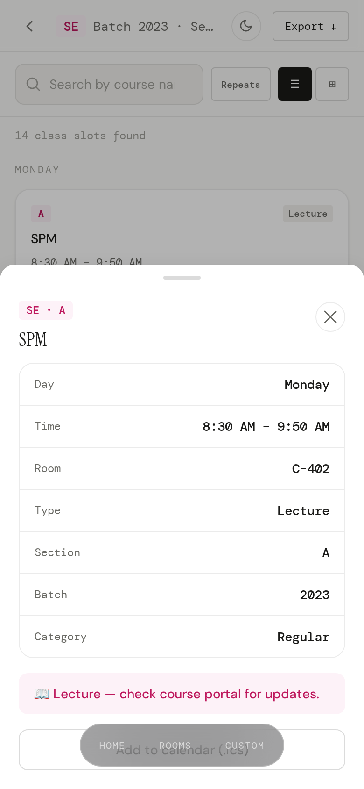
</p>

### Custom Exams
<p>
   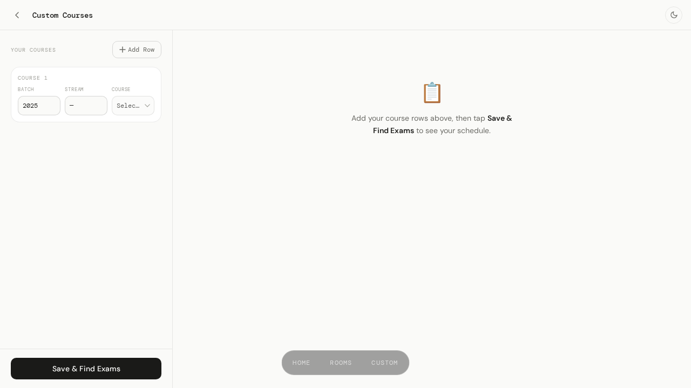
   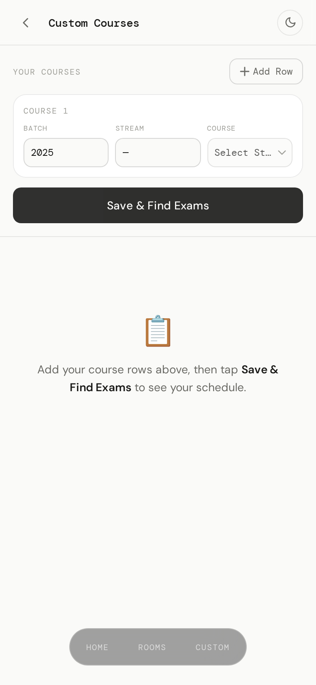
</p>

### Custom Timetable
<p>
   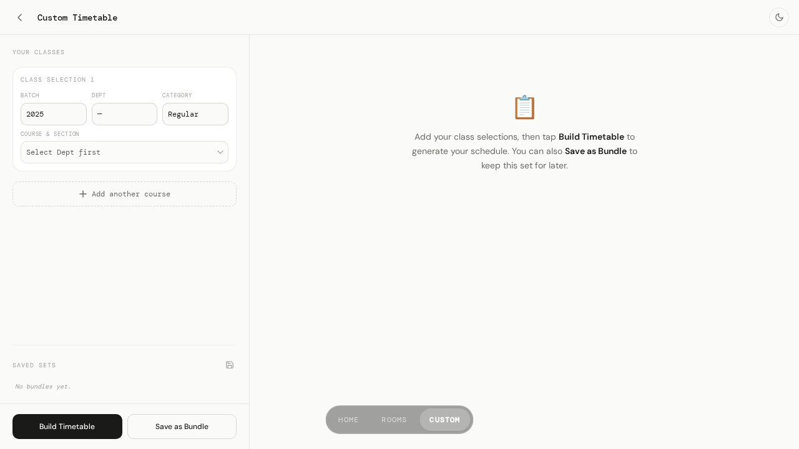
   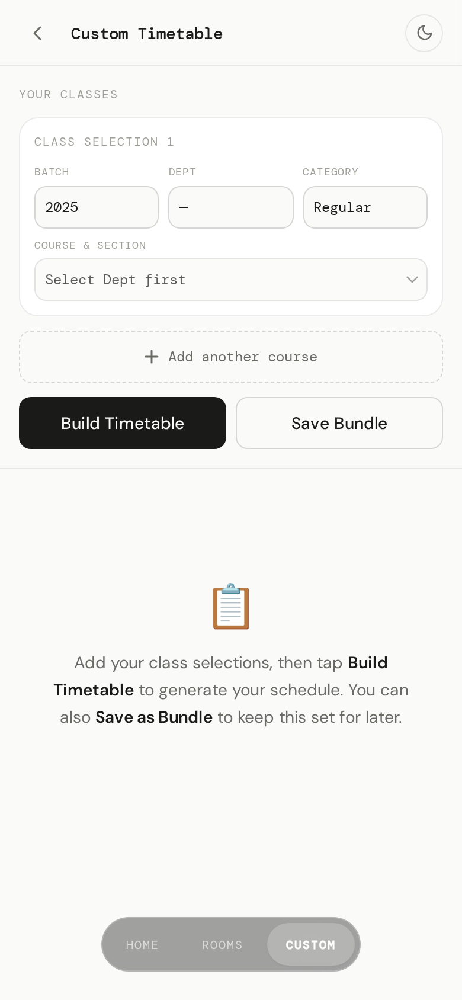
</p>

### Free Rooms
<p>
   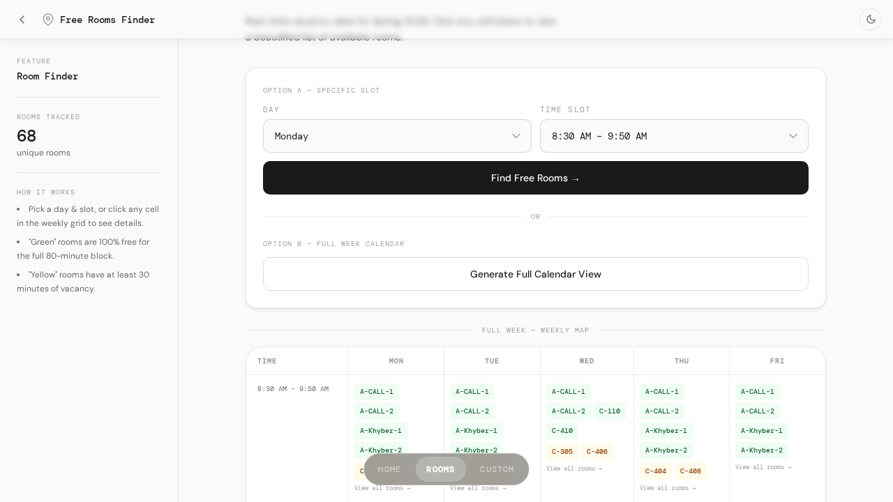
   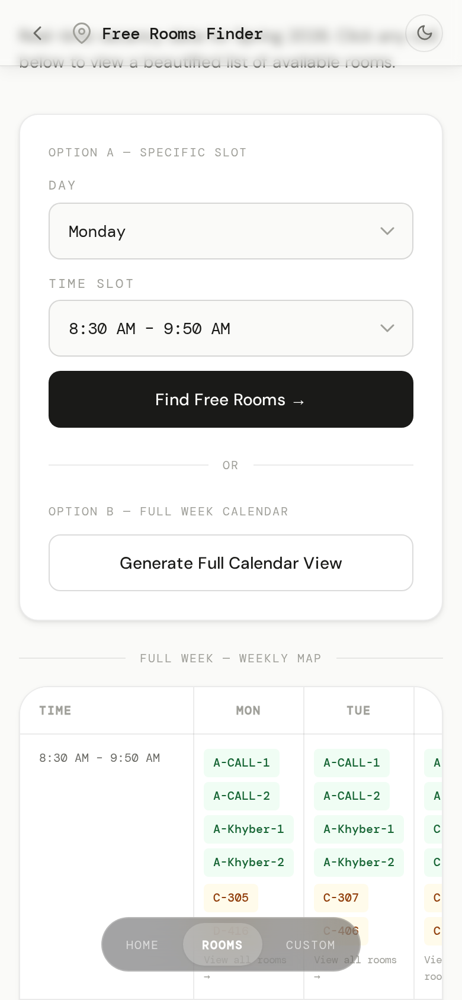
</p>

## Tech Stack

- Next.js 14 (App Router)
- React 18 + TypeScript
- Tailwind CSS
- `xlsx` for Excel parsing
- `exceljs` for export generation

## Data Pipeline

There are two primary data pipelines in this project:

1. Exam Finder pipeline
- Source: `exam_schedule.xlsx`
- Purpose: powers the Exam Schedule / Exam Finder feature only.
- Output: normalized exam data in `public/data/schedule.json`
- Parser entrypoint: `scripts/parse-excel.ts`

2. Timetable + Free Rooms pipeline
- Source: semester schedule fetched from Google Sheets.
- Purpose: powers both the Timetable and Free Rooms features.
- Output: normalized timetable data in `public/data/timetable.json`

## Routes

- `/` -> setup/configuration home
- `/schedule` -> exam results
- `/custom` -> custom exam builder
- `/timetable` -> timetable results
- `/timetable/custom` -> custom timetable builder + bundles
- `/rooms` -> free room finder
- `/api/schedule` -> filtered exam JSON API

## Local Development

1. Install dependencies:
```bash
npm install
```

2. Start development server:
```bash
npm run dev
```

3. Open:
```text
http://localhost:3000
```

## Available Scripts

- `npm run dev` -> runs parser, then starts Next.js dev server
- `npm run build` -> production build
- `npm run start` -> start production server
- `npm run type-check` -> TypeScript checks
- `npm run lint` -> Next.js linting

## Notes

- This project is built for FAST ISB students and schedule planning workflows.
- Screenshot files are stored in `Screenshots/` and can be re-captured any time from the running app.
- Screenshot automation script: `scripts/capture-screenshots.js`
