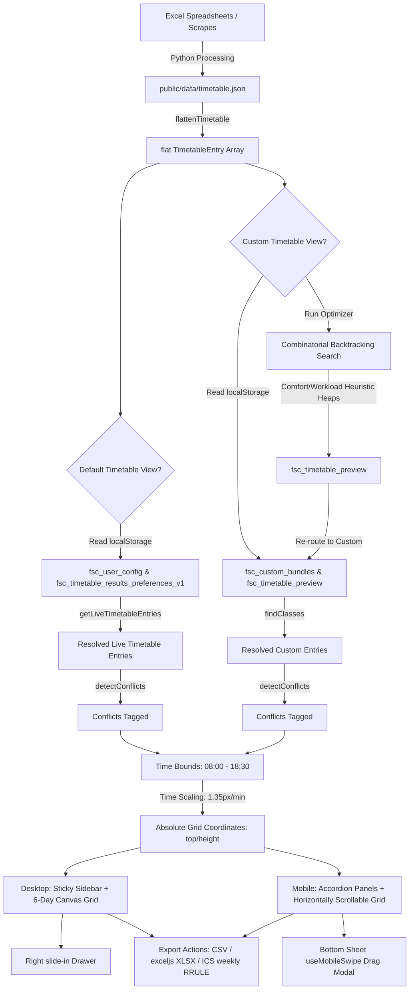

# FAST ISB Schedule Platform: Timetable Architecture & Engineering Analysis

This document provides a comprehensive technical analysis of the visual, structural, and functional logic behind both the regular and custom timetable features of the FAST ISB Schedule Platform. It outlines the visual layouts, data structures, state persistence, conflict detection heuristics, scheduling optimizer mechanics, and exporting pipelines.

---

## 1. Visual Logic & Layout Architecture

The user interface of the Timetable module utilizes a hybrid rendering layout, supporting both a chronological List View and an absolute-positioned Canvas Grid View.

### A. Days of the Week & Order
Timetable days are ordered chronologically using the `DAYS_ORDER` constant imported from `src/lib/types.ts`:
```typescript
export const DAYS_ORDER: string[] = [
  'Monday', 'Tuesday', 'Wednesday', 'Thursday', 'Friday', 'Saturday',
];
```
In List View, days without scheduled classes render a dashed placeholder reading: *"No classes scheduled for today"*.

### B. Vertical Time Scale & Grid Coordinates (Grid View)
In Grid View (`GridView` in `/timetable` and `GridViewCustom` in `/timetable/custom`), the timetable day columns are treated as absolute-positioned canvases:
* **Time Bounds**: Starting at `08:00` (`GRID_START = 8 * 60 = 480` minutes past midnight) and ending at `18:30` (`GRID_END = 18.5 * 60 = 1110` minutes past midnight).
* **Scale Factor (`PX_PER_MIN`)**: Set to `1.35 px/min`. A standard 90-minute lecture translates to height:
  $$\text{Height} = 90 \times 1.35 = 121.5\text{px}$$
* **Time Column**: Displays vertical time labels (e.g., "08:00", "09:00") at a fixed width of `56px` (`TIME_COL_WIDTH`).
* **Columns Structure**: Standard CSS Grid layout with weekday column headers styled as sticky elements:
  ```typescript
  const gridTemplateColumns = `${TIME_COL_WIDTH}px repeat(${dayCount}, minmax(0, 1fr))`;
  ```

For each card in a day, its vertical top offset and height are computed dynamically:
```typescript
const [start, end] = parseTimeRange(e.time);
const top = (start - GRID_START) * PX_PER_MIN;
const height = (end - start) * PX_PER_MIN;
```

---

### C. Course Card Component (`TimetableCard`)
The `TimetableCard` component (`src/components/TimetableCard.tsx`) handles course slot rendering.

#### Styling & Color Coding
* **Left Colored Border Strip**: Represents the department's accent color dynamically:
  ```typescript
  const stripColor = conflicting ? '#f87171' : accentColor;
  ```
  `accentColor` corresponds to theme-defined variables, such as `var(--accent-cs)` for Computer Science, `var(--accent-ai)` for Artificial Intelligence, `var(--accent-ds)` for Data Science, `var(--accent-cy)` for Cyber Security, and `var(--accent-se)` for Software Engineering.
* **Repeat Course Surface**: Repeat courses are styled with an amber gradient to visually differentiate them from regular lectures:
  ```typescript
  background: isRepeat
    ? 'linear-gradient(135deg, var(--color-bg-raised) 50%, color-mix(in srgb, var(--color-bg-raised) 80%, #f59e0b 20%))'
    : 'var(--color-bg-raised)'
  ```
* **Semantic Badges**:
  * **Conflict**: Red warning block (`⚠ Conflict`) if the card overlaps with another scheduled slot.
  * **Exam**: Red calendar block (`📅 Exam`) if the slot represents an exam.
  * **Rescheduled**: Amber star block (`✨ Rescheduled`) if marked as rescheduled.
  - **Lecture vs. Lab**: Indicated via a text badge. Lab status is inferred by checking if the course name ends with the substring `"Lab"` (applying the Data Science theme color).

---

### D. Overlapping & Clash Visual Management
* **List View**: Chronologically lists all slots in a responsive layout (`flex flex-col gap-2 md:grid md:grid-cols-2 lg:grid-cols-3`). Conflicts are signaled via the `⚠ Conflict` badge; cards never overlap physically.
* **Grid View**: Elements are absolutely positioned within the day columns:
  ```html
  <button className="absolute left-0.5 right-0.5 md:left-1 md:right-1 ..." style={{ top, height, zIndex }} />
  ```
  * **Direct Stacking Bug/Constraint**: Because cards share identical horizontal offsets (`left: 0.5` / `right: 0.5`), classes scheduled at the exact same time overlay one another.
  * **Z-Index Resolution**: Conflicting cards receive a higher z-index (`zIndex: isConflict ? 10 : 1`). If multiple cards conflict, they all receive `zIndex: 10`; the card rendered last in the DOM array will cover the ones preceding it.
  * **Background Overrides**: Conflicting backgrounds switch to solid light red (`#fef2f2`) or a striped pattern (`repeating-linear-gradient(...)`) if a repeat course is involved.

---

### E. Responsive Viewports & Layouts
The platform adapts components at the `768px` (`md`) breakpoint.

| UI Component / Property | Mobile Viewport (`< md`) | Desktop Viewport (`>= md`) |
| :--- | :--- | :--- |
| **Main Navigation & Controls** | Header inline buttons (Search, View mode toggles, Repeats switch, Preferences) | Sticky sidebar (`sticky top-14 w-56 lg:w-64 h-[calc(100vh-56px)]`) |
| **Time Grid Display** | Horizontal scrollable wrapper (`overflow-x-auto min-w-[980px]`) | Native fitting inside the container |
| **Class Selection Accordion** | Expandable panel replacement (labeled **"Your Classes"**) | Static configuration panel |
| **Details Sheets** | Bottom Sheet covering `85%` height (`h-[85dvh] bottom-0 left-0 right-0`) | Slide-in drawer on the right side (`md:right-0 md:w-96 md:h-auto md:top-14`) |

#### Mobile Accordion Sidebar
To maximize workspace, the desktop sidebar editor is replaced on mobile devices by an expandable accordion panel. In `/timetable/custom`, tapping the **"Your Classes"** or **"Saved Sets"** accordion header toggles the list of active row editors, preventing UI crowding.

#### Details Sheet & Drag Gestures (`useMobileSwipe`)
The detail drawer utilizes the custom `useMobileSwipe` hook (`src/hooks/useMobileSwipe.ts`) to handle mobile dragging gestures:
1. **Synchronous Height Initialization**: Sets initial heights directly (`drawer.style.height = defaultHeightStr`) before first paint to prevent layout flashes.
2. **Velocity-Based Flicking**: Computes gesture velocity via an exponential moving average:
   $$\text{velocityY} = \text{velocityY} \times 0.6 + \left(\frac{y - \text{lastY}}{\text{dt}}\right) \times 0.4$$
   If velocity exceeds `0.4 px/ms` (even with a swipe distance $< 40\text{px}$), the gesture completes automatically.
3. **Interactive Translation**: Applies 1:1 finger tracking, rubber-banding when dragging past bounds, and snaps back using a spring cubic-bezier easing (`cubic-bezier(0.32, 0.72, 0, 1)`).
4. **Smooth Unmount Prevention**: Instead of unmounting immediately, close actions trigger a `translateY(100%)` animation over `280ms`, calling the parent `onClose` hook on completion.

---

## 2. Structural Data & State Architecture

### A. Timetable JSON Schema
Timetable schedules are stored statically at `public/data/timetable.json`. It maps as follows:
$$\text{Batch} \rightarrow \text{Department} \rightarrow \text{Category ("regular" or "repeat")} \rightarrow \text{Course Name} \rightarrow \text{Section} \rightarrow \text{Day Name} \rightarrow \text{Slot Array}$$

The bottom of the file houses meta details under `__meta__`:
```json
{
  "2025": {
    "CS": {
      "regular": {
        "OOP": {
          "E": {
            "Monday": [
              {
                "room": "C-301",
                "time": "08:30-09:50",
                "rescheduled": false,
                "is_elective": false,
                "elective_group": null,
                "exam": false
              }
            ]
          }
        }
      }
    }
  },
  "__meta__": {
    "days": {
      "Monday": {
        "sheetName": "Monday (May 11)",
        "date": "11 May"
      }
    }
  }
}
```

---

### B. Core TypeScript Types
All core interfaces reside in `src/lib/types.ts` and page components:

```typescript
// src/lib/types.ts

export interface TimetableEntry {
  courseName: string;                  // e.g., "Programming Fundamentals"
  batch: string;                       // e.g., "2024"
  department: string;                  // e.g., "CS"
  section: string;                     // e.g., "A", "BX", "A1"
  day: string;                         // e.g., "Monday"
  time: string;                        // e.g., "08:30 - 10:00"
  room: string;                        // e.g., "CR-01"
  type: 'lecture' | 'lab';             // Inferred: 'lab' if name ends with 'Lab'
  category: 'regular' | 'repeat';      // Mapping hierarchy category
  rescheduled?: boolean;               // Flags manual overrides
  exam?: boolean;                      // Flags midterms/sessionals
  isElective?: boolean;                // Inferred elective flag
  electiveGroup?: string | null;       // Elective group identifier (e.g. "G-I")
}

export interface TimetableSheetMeta {
  sheetName: string;
  date?: string;
}

export interface TimetableMetadata {
  days: Record<string, TimetableSheetMeta>;
}

export type TimetableSlot = {
  room: string;
  time: string;
  rescheduled?: boolean;
  exam?: boolean;
  isElective?: boolean;
  elective_group?: string | null;
};

export type TimetableDayMap = Record<string, TimetableSlot[]>;
export type TimetableSectionMap = Record<string, TimetableDayMap>;
export type TimetableCourseMap = Record<string, TimetableSectionMap>;

export interface TimetableDepartmentMap {
  regular: TimetableCourseMap;
  repeat: TimetableCourseMap;
}

export type TimetableBatchMap = Record<string, TimetableDepartmentMap>;

export type RawTimetableJSON = Record<string, TimetableBatchMap> & {
  __meta__?: TimetableMetadata;
};
```

Additional types used in custom page state management and parsing:

```typescript
// src/lib/timetable-live.ts
export type CourseKey = string; // Format: "dept|category|courseName"

export interface UserConfig {
  batch: string;
  school: string;
  dept: string;
  section: string;
}

export interface TimetableResultPreference {
  sectionByCourse: Record<CourseKey, string>;
  removedCourseKeys: CourseKey[];
}

// src/app/timetable/custom/page.tsx
export interface CourseRow {
  id: string;
  batch: string;
  stream: string;
  category: string;
  selection: string; // Format: "Course Name | Section"
  errorBatch: boolean;
  errorStream: boolean;
  errorCategory: boolean;
  errorSelection: boolean;
}

export interface Bundle {
  id: string;
  name: string;
  rows: CourseRow[];
}
```

---

### C. State Management & Persistence Flow
Timetable customizations are persisted on the client side using four `localStorage` keys:

1. **`fsc_user_config`**: Stores the user's primary setup (`UserConfig`) selected on the landing page.
2. **`fsc_timetable_results_preferences_v1`**: Holds section overrides and hidden courses (type `Record<string, TimetableResultPreference>`), scoped internally by `batch|dept`.
3. **`fsc_custom_bundles`**: Contains saved custom timetable sets (type `Bundle[]`) for the Custom Timetable builder.
4. **`fsc_timetable_preview`**: A temporary array of `CourseRow` objects containing sections computed by the Optimizer.

#### Preferences Merge Algorithm (`getLiveTimetableEntries`)
To build the personalized schedule in the default view, `getLiveTimetableEntries` runs on load:
1. **Scope Filtering**: Filters raw timetable entries matching current `batch` and `dept` (`contextEntries`).
2. **Defaults Parsing**: Filters entries matching the default `section` (`defaultEntries`) and maps their course keys.
3. **Overrides Cleansing**: Validates manual overrides in `sectionByCourse` against `contextEntries` to ensure the target sections exist.
4. **Section Swapping**: Merges default section keys with valid manual overrides.
5. **Visibility Filtering**: Excludes keys stored in the user's `removedCourseKeys`.
6. **Slot Extraction**: Iterates over valid courses, gathers slots matching active sections (normalizing sections for Batch 2025 by stripping trailing digits), and returns the deduped, chronological schedule.

#### Mutual Exclusivity Constraint
To prevent conflicting schedules, the app enforces exclusivity between **Default Setup** and **Custom Bundles**:
* **Home Page Exclusivity**: Saving default preferences blocks if `fsc_custom_bundles` has saved sets, throwing the error: *"Oops! You already have some Saved Bundles in the Custom Courses section..."*
* **Custom Page Exclusivity**: Building/saving custom bundles blocks if `fsc_user_config` is found, showing: *"Wait! You have some Saved Preferences in the Default view..."*

---

## 3. Functional Logic, Rules & Algorithms

### A. Searching & Filtering
* **Search Execution**: Queries match against `courseName`, `room`, or `section` strings.
* **Batch 2025 Normalization**: For the 2025 batch, sections are normalized using `section.replace(/\d+$/, '')` so that sub-sections (e.g. A1, A2) resolve correctly to the parent section filter.
* **Shared Departments**: Handles combined departments like `AI/DS` by splitting with `/` and validating matches.

---

### B. Conflict Detection Rules
Clashes represent overlapping slots on the same day.
* **FAST PM Heuristic**: Hour values between `1` and `7` in 24-hour style format strings are shifted by adding 12 hours (e.g., `"01:00"` translates to `"13:00"`), accommodating FAST University's class windows.
* **Overlap Calculation**: Start and end values are converted to minutes past midnight. Overlaps trigger if:
  $$\text{aStart} < \text{bEnd} \quad \text{and} \quad \text{bStart} < \text{aEnd}$$
* **Rules & Exceptions**:
  1. **Exclusions**: Saturday courses, rescheduled entries (`rescheduled: true`), and exams (`exam: true`) do not flag conflicts.
  2. **Sub-section Exemptions (Batch 2025)**: Clashes between different sub-sections (e.g., A1 overlapping A2) are ignored.
  3. **Repeat Filter**: If repeats are hidden, conflicts involving repeat courses are ignored.

---

### C. Room Vacancy Rules
The **Free Room Finder** inverted calendar (`src/lib/room-logic.ts`) parses the entire dataset to group busy slots by room and day. Room status for a given time window is evaluated as:
* **Fully Vacant**: Overlap with scheduled classes is exactly $0$ minutes.
* **Partially Vacant**: Overlap is $> 0$ minutes, but the room remains free for $\ge 30$ minutes during the slot.
* **Busy**: Free time is $< 30$ minutes; the room is flagged as occupied and omitted.

---

### D. Backtracking Optimizer Logic
The **Timetable Optimizer** (`src/components/TimetableOptimizer.tsx`) runs a combinatorial depth-first backtracking search over section permutations to find clash-free allocations.

#### Workload & Comfort Scoring Heuristics
Schedules are scored using a Comfort rating (starts at $100\%$) and a Workload Penalty rating (starts at $0$ points):
* **On-Campus Span**: The difference between the first start and last end time on each active day is added directly to the Workload Penalty.
* **Consecutive Afternoon Fatigue**: Consecutive blocks separated by $\le 20$ minutes extending past 3:50 PM trigger a **300 point workload penalty** and a **25% comfort deduction**.
* **Consecutive Morning Fatigue**: Three or more consecutive AM classes separated by $\le 20$ minutes trigger a **150 point workload penalty** and a **10% comfort deduction**.
* **Midday Break Conditions**: A valid lunch break must fall between 11:30 AM and 2:30 PM, lasting 30 to 100 minutes.
  * If a student is on campus during midday (arrives $\le 11:30$ AM and leaves $\ge 1:30$ PM) but has no gap, a **200 point workload penalty** and a **20% comfort deduction** are applied.
  * If a valid midday gap is achieved, its duration is penalized at only 10% for bad gaps.
* **Bad Gaps**: Gaps $> 20$ minutes (except valid midday breaks) add `gapDuration * 1.5` to the workload score, and deduct 1% comfort for every 10 minutes.
* **Early & Late Classes**: Start times $\le 8:30$ AM add **40 points**; end times $\ge 4:00$ PM add **50 points**.
* **Daily Class Volume**: Having $> 3$ classes in a single day adds **120 points** and a **5% comfort deduction** per extra class.

#### Sorting and Fit Score Calculation
Computed options are sorted by the active **Optimization Goal**:
* **Maximize Off-Days**: Penalty = $(\text{activeDays} \times 10000) + \text{workloadScore}$
* **Minimize Workload**: Penalty = $(\text{workloadScore} \times 100) + \text{activeDays}$
* **Balanced**: Penalty = $\text{workloadScore} + (\text{activeDays} \times 250)$
* **Custom**: Weighted sum based on user preferences.

The top 15 schedules are assigned a visual **Fit Score** scaled relative to the best schedule option:
$$\text{Fit Score} = 100 - \left( \frac{\text{Penalty} - \text{Min Penalty}}{\text{Max Penalty} - \text{Min Penalty}} \times 40 \right)$$

---

### E. Export Mechanisms
* **CSV Export**: Compiles entries into comma-delimited columns.
* **XLSX Export**: Uses `exceljs` on the client side:
  * Generates formatted headers with dark navy blue fill (`FF1F3864`), white bold text, and centered text.
  * Injects thin borders (`FFD9D9D9`) around all data cells, left-aligning the course name column.
* **iCalendar (ICS) Recurrence**: Renders weekly repeating events:
  1. Computes the first target weekday date (`nextWeekday`).
  2. Applies a recurrence rule (`RRULE`) repeating weekly (`FREQ=WEEKLY;BYDAY=...`) until a date computed exactly 16 weeks after semester start.

---

## 4. End-to-End Data Flow & Pipeline

The pipeline starts with raw Excel spreadsheets parsed on the server side and flows down to interactive DOM elements on the client side.

### Data Flow Walkthrough
1. **Excel Generation & Scraping**: Raw schedules are scraped or parsed into standard spreadsheets, which Python scripts process into the nested `timetable.json` file.
2. **Flattening**: The frontend loads the JSON and runs `flattenTimetable()` to build a clean `TimetableEntry[]` array.
3. **Configuration & Scoping**: The application reads `localStorage` (or checks the URL query strings) to load the active `UserConfig` (Default view) or `CourseRow[]` selection (Custom view).
4. **Resolution**:
   * For Default: `getLiveTimetableEntries()` merges default section slots with section overrides, filters out hidden courses, and resolves conflicts.
   * For Custom: `findClasses()` maps rows to respective courses/sections, returning matching slots.
5. **Visual Grid Mapping**: The coordinates of each slot are mapped using the `1.35 px/min` scale.
6. **Rendering**: React maps the items into `TimetableCard` elements, absolutely positioned in Grid View or rendered as list panels.

### Pipeline Architecture (Mermaid)


